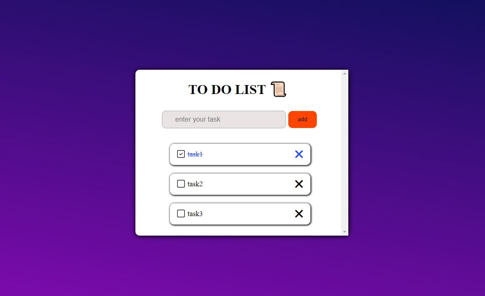

# 📝 Simple Todo List with LocalStorage

A minimalist, lightweight todo list built with HTML, CSS, and JavaScript. Tasks are saved automatically in your browser using LocalStorage, so you won't lose your notes when you refresh or close the page.

---

## 🚀 Features

- ✅ Add new todo items
- ✅ Mark items as completed
- 🗑️ Delete individual items
- 💾 Automatic saving to LocalStorage
- 🧠 No backend or database needed

---

## 📷 Preview

> You can take a screenshot of your app and name it `screenshot.png`, then upload it to the repo.

---

